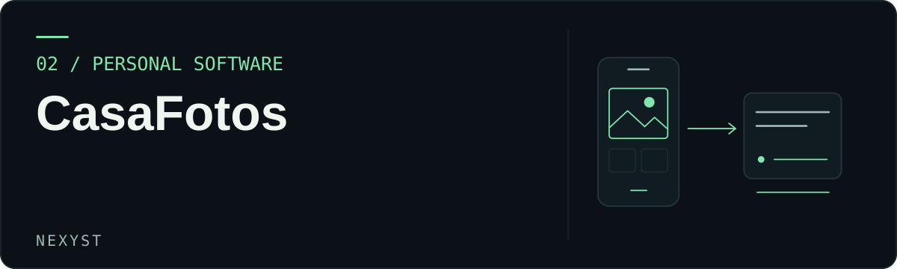
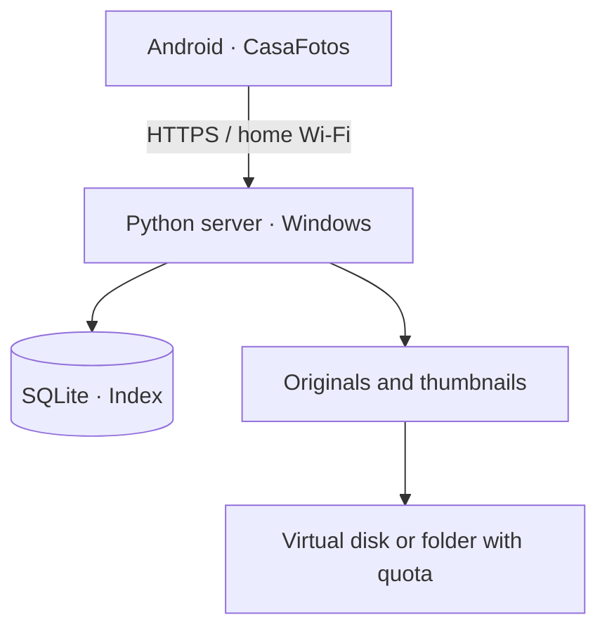

<picture>
  <source media="(max-width: 600px)" srcset="./assets/cover-mobile.svg">
  
</picture>

[Português](README.md) · [English](README.en.md)

# CasaFotos

**Your photos on your computer. Your library on your phone.**

CasaFotos grew out of a personal problem: keeping original photos on a home computer while still browsing them on Android. The project connects a mobile interface in Java, a Python backend, a SQLite index and local storage on Windows.

The app lets you select, send and browse photos and videos on your home network. The server stores the files and thumbnails without requiring an account with an external photo provider. It is an integrated application prototype, with installation and diagnostics on the PC.

> [!IMPORTANT]
> **Experimental project.** The Windows installer created and formatted a new VHD in a real test, and the server responded locally over HTTPS. End-to-end transfer and removal on Android still need validation. Do not keep the only copy of important photos in this version. Use test files and keep a separate backup.

## Features

| Component | What is in the code | Status |
| :--- | :--- | :--- |
| Android | Thumbnail gallery, search, albums and viewing | Implemented in code |
| Import | Selection of photos and videos through the Android **document** picker, with progress feedback | Implemented in code |
| Storage | Originals, thumbnails, metadata and storage quota | Server tests available |
| Integrity | SHA-256 verification of the received file | Server tests available |
| Optional removal | Asks the user and requests Android authorization where supported | Needs validation on a real device |
| Windows | Installation, diagnostics and mounting a fixed virtual disk | Initial installation observed |
| Network | HTTPS and pairing on the local network | Local response observed |

**What it does not do yet:** open Samsung Gallery directly or appear as a target in the phone's Share menu. Tapping **Adicionar fotos** (Add photos) opens the document picker in the current version. The visual photo picker experience is planned work, not a completed feature.

## How it works



When importing images, the app sends the originals to the server. After confirming the integrity of the stored file, it presents two options: **keep the originals** or **request removal on Android**. Removal depends on authorization and the rules of the device's file provider.

The computer must be switched on and awake to receive new images and serve originals that are no longer on the phone. **The 30 GB virtual disk is not a backup**: it still depends on the same SSD.

## Getting started

### 1. Requirements

| Part | Environment |
| :--- | :--- |
| PC | Windows, PowerShell, NTFS and administrator permissions for installation |
| Server | Python 3.12 x64 and the dependencies in `servidor/requirements.txt` |
| Phone | Android 11 or later |
| Android build | JDK 17, SDK Platform 35 and Build Tools 35.0.0 |
| Network | Same local network, TCP 47831 and the **Private** Windows firewall profile |

### 2. Understand the published version

This repository contains **source code and scripts**, not a signed APK or a fully offline installer. To rebuild the offline distribution, obtain the Python 3.12 x64 embeddable package and Windows wheels separately from official sources.

Place the embeddable package in `servidor/python-windows.zip`. To download the dependencies, run this in an environment with Python and pip:

```powershell
py -m pip download --only-binary=:all: --platform win_amd64 --python-version 3.12 --implementation cp --abi cp312 --dest servidor/wheels -r servidor/requirements.txt
```

The `INSTALAR_PC.cmd` script depends on these files. **A clone of this repository alone cannot perform the complete offline installation.**

> [!CAUTION]
> If you already have a CasaFotos library, do not run VHD creation or formatting again. Make a backup first and use `VERIFICAR_PC.cmd` to inspect the installation.

### 3. Build the Android app

Open `android/` in Android Studio and configure the SDK/JDK, or consult `android/build_apk.py`. Sign the APK with your own key, stored outside the repository.

```powershell
$env:CASAFOTOS_KS_PASS = Read-Host 'Keystore password'
python android/build_apk.py --sdk 'C:\Android\Sdk' --jdk 'C:\jdk-17' --keystore 'C:\Chaves\casafotos.jks' --key-alias casafotos
Remove-Item Env:CASAFOTOS_KS_PASS
```

These paths are examples. APKs signed with different keys may be unable to update an earlier Android installation.

### 4. Test the server logic

```powershell
python -m pip install -r servidor/requirements.txt
python -m unittest discover -s testes -v
```

The tests use artificial files and temporary directories. See [VALIDACAO.md](VALIDACAO.md) for the observations and remaining checks.

## Project structure

```text
CasaFotos/
├── android/        Android app, resources and build script
├── servidor/       Python API, panel and Windows installation
├── testes/         Server tests and static checks
├── assets/         Repository visual identity
├── README.md       Introduction and instructions in Portuguese
├── README.en.md    Equivalent documentation in English
├── SECURITY.md     Security and limitations
├── CONTRIBUTING.md Contributions
└── CHANGELOG.md    Project history
```

## Security and privacy

The connection between the app and the PC is designed for a home network. **Do not expose port 47831 to the Internet.** The project uses pairing and local HTTPS; it should not be treated as a hardened storage service for public exposure.

The repository does not publish photos, databases, VHD files, passwords, private certificates or signing keys. If you fork it, keep this data out of version control.

Read [SECURITY.md](SECURITY.md) before testing with personal data.

## Next steps

- [ ] Visual Android photo picker.
- [ ] Send directly from the gallery's Share action.
- [ ] Real import and removal tests on different devices.
- [ ] Clearer progress feedback and connection diagnostics.
- [ ] Backup and restore to a second disk.
- [ ] Installation and updates that preserve existing libraries.

<details>
<summary><strong>Frequently asked questions</strong></summary>

**Does it work with the PC switched off?** No. Originals stored only on the PC require the server to be available.

**Is the 30 GB allocation a new partition?** Not necessarily. Installation can use a fixed virtual disk file hosted on the SSD.

**Does it delete photos automatically?** It should not delete originals without the user's choice and the applicable Android authorization. The full workflow still needs validation on a real device.

**Can I install it with one click from GitHub?** No. This is the source repository, without third-party dependencies or a signed APK.

</details>

CasaFotos is a personal project by [NexysT](https://github.com/NexysT) and is not affiliated with Google or Google Photos.

