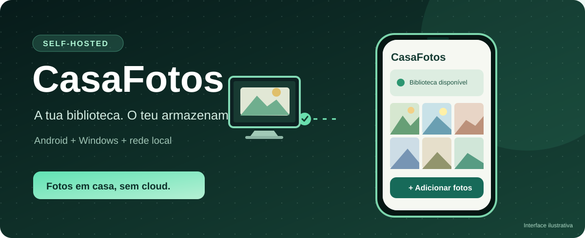
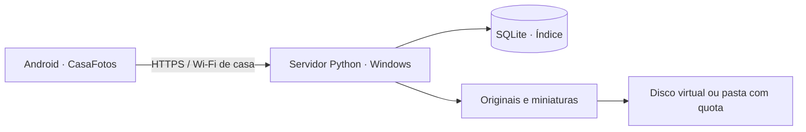

<div align="center">



<br>


<br><br>

**As fotografias no teu computador. A biblioteca no telemóvel.**

[Explorar funcionalidades](#funcionalidades) · [Como funciona](#como-funciona) · [Começar](#começar) · [Segurança](#segurança-e-privacidade)

</div>

<br>

## Uma biblioteca pessoal, em casa

Criei o **CasaFotos** a partir de uma ideia simples: permitir que alguém mantenha os originais das suas fotografias num computador de casa e continue a consultá-los numa aplicação Android. Queria experimentar todo o percurso, desde a escolha das imagens no telemóvel até ao armazenamento e à recuperação dos ficheiros.

O resultado é um protótipo composto por um servidor Python para Windows e uma aplicação Android em Java. O servidor guarda a biblioteca, os ficheiros e as miniaturas. O telemóvel funciona como interface para escolher, enviar e consultar imagens através da rede local.

<table>
<tr>
<td width="50%" valign="top">
<h3>01 · No telemóvel</h3>
<p>Escolhe fotografias ou vídeos, acompanha a importação e consulta a biblioteca organizada em miniaturas.</p>
</td>
<td width="50%" valign="top">
<h3>02 · No computador</h3>
<p>O servidor guarda os originais, gere o índice da biblioteca e pode utilizar um disco virtual com cerca de 30 GB.</p>
</td>
</tr>
<tr>
<td width="50%" valign="top">
<h3>03 · Com confirmação</h3>
<p>Depois da verificação da cópia, a app pergunta se queres manter os originais no Android ou solicitar a remoção.</p>
</td>
<td width="50%" valign="top">
<h3>04 · Sem conta na cloud</h3>
<p>O protótipo não precisa de uma conta de um fornecedor externo de fotografias para apresentar a biblioteca em casa.</p>
</td>
</tr>
</table>

> [!IMPORTANT]
> **Projeto experimental.** O instalador Windows criou e formatou um novo VHD num teste real e o servidor respondeu localmente por HTTPS. Ainda falta validar ponta a ponta a transferência e a remoção no Android. Não guardes a única cópia de fotografias importantes nesta versão. Experimenta com ficheiros de teste e mantém um backup separado.

<br>

## Funcionalidades

| Componente | O que está no código | Estado |
| :--- | :--- | :--- |
| Android | Galeria com miniaturas, pesquisa, álbuns e visualização | Implementado no código |
| Importação | Escolha de fotografias e vídeos pelo seletor de **documentos** Android | Implementado no código |
| Armazenamento | Originais, miniaturas, metadados e quota de espaço | Testes do servidor disponíveis |
| Integridade | Verificação SHA-256 do ficheiro recebido | Testes do servidor disponíveis |
| Remoção opcional | Pergunta à pessoa e pede autorização ao Android quando suportado | Por validar num dispositivo real |
| Windows | Instalação, diagnóstico e montagem de disco virtual fixo | Instalação inicial observada |
| Rede | HTTPS e emparelhamento na rede local | Resposta local observada |

**O que ainda não faz:** abrir diretamente a Galeria Samsung nem aparecer como destino no menu Partilhar do telemóvel. Ao tocar em **Adicionar fotos**, a versão atual abre o seletor de documentos. A experiência de galeria fotográfica está no plano de evolução, não na lista de funcionalidades concluídas.

<br>

## Como funciona



Ao importar imagens, a aplicação envia os originais para o servidor. Depois de confirmar a integridade do ficheiro guardado, apresenta duas opções: **manter os originais** ou **pedir a remoção no Android**. A remoção depende da autorização e das regras do fornecedor de ficheiros do dispositivo.

O computador precisa de estar ligado e acordado para receber novas imagens e disponibilizar os originais que já não estão no telemóvel. **O disco virtual de 30 GB não é um backup**: continua a depender do mesmo SSD.

<br>

## Começar

### 1. Requisitos

| Parte | Ambiente |
| :--- | :--- |
| PC | Windows, PowerShell, NTFS e permissões de administrador para instalar |
| Servidor | Python 3.12 x64 e dependências em `servidor/requirements.txt` |
| Telemóvel | Android 11 ou superior |
| Build Android | JDK 17, SDK Platform 35 e Build Tools 35.0.0 |
| Rede | Mesma rede local, TCP 47831 e perfil **Privado** na firewall do Windows |

### 2. Conhecer a versão publicada

Este repositório contém **código-fonte e scripts**, não o APK assinado nem o instalador totalmente offline. Para reconstruir a distribuição offline, tens de obter separadamente o pacote embeddable de Python 3.12 x64 e os wheels para Windows, a partir das fontes oficiais.

O pacote embeddable é colocado em `servidor/python-windows.zip`. Para transferir as dependências, executa num ambiente com Python e pip:

```powershell
py -m pip download --only-binary=:all: --platform win_amd64 --python-version 3.12 --implementation cp --abi cp312 --dest servidor/wheels -r servidor/requirements.txt
```

O script `INSTALAR_PC.cmd` depende destes elementos. **Não executa a instalação offline completa apenas com um clone deste repositório.**

> [!CAUTION]
> Se já tens uma biblioteca CasaFotos, não voltes a executar a criação ou formatação do VHD. Faz primeiro uma cópia de segurança e usa `VERIFICAR_PC.cmd` para consultar o estado da instalação.

### 3. Compilar a app Android

Abre `android/` no Android Studio e configura o SDK/JDK, ou consulta `android/build_apk.py`. A assinatura do APK deve usar uma chave tua, guardada fora do repositório.

```powershell
$env:CASAFOTOS_KS_PASS = Read-Host 'Password da chave'
python android/build_apk.py --sdk 'C:\Android\Sdk' --jdk 'C:\jdk-17' --keystore 'C:\Chaves\casafotos.jks' --key-alias casafotos
Remove-Item Env:CASAFOTOS_KS_PASS
```

Os caminhos são exemplos. APKs assinados com chaves diferentes podem não atualizar uma instalação Android anterior.

### 4. Testar a lógica do servidor

```powershell
python -m pip install -r servidor/requirements.txt
python -m unittest discover -s testes -v
```

Os testes usam ficheiros artificiais e diretórios temporários. Consulta [VALIDACAO.md](VALIDACAO.md) para saber o que foi observado e o que falta confirmar.

<br>

## Estrutura do projeto

```text
CasaFotos/
├── android/        App Android, recursos e script de build
├── servidor/       API Python, painel e instalação Windows
├── testes/         Testes do servidor e verificações estáticas
├── assets/         Identidade visual deste repositório
├── README.md       Introdução e instruções
├── SECURITY.md     Segurança e limitações
├── CONTRIBUTING.md Contribuições
└── CHANGELOG.md   Evolução do projeto
```

<br>

## Segurança e privacidade

A ligação entre a aplicação e o PC foi desenhada para uma rede doméstica. **Não abras a porta 47831 para a Internet.** O projeto utiliza emparelhamento e HTTPS local; não deve ser considerado um serviço de armazenamento endurecido para exposição pública.

O repositório não publica fotografias, bases de dados, ficheiros VHD, passwords, certificados privados ou chaves de assinatura. Se fizeres um fork, mantém esses dados fora do controlo de versões.

Consulta [SECURITY.md](SECURITY.md) antes de testar com dados pessoais.

<br>

## Próximos passos

- [ ] Seletor visual de fotografias Android.
- [ ] Envio diretamente da ação Partilhar da galeria.
- [ ] Testes reais de importação e remoção em diferentes dispositivos.
- [ ] Feedback de progresso e diagnóstico de ligação mais claros.
- [ ] Backup e restauro para um segundo disco.
- [ ] Instalação e atualização sem risco para bibliotecas existentes.

<br>

<details>
<summary><strong>Perguntas frequentes</strong></summary>

**Funciona com o PC desligado?** Não. Os originais que estão apenas no PC exigem que o servidor esteja disponível.

**Os 30 GB são uma nova partição?** Não necessariamente. A instalação pode usar um ficheiro de disco virtual fixo alojado no SSD.

**Apaga fotografias automaticamente?** Não deve apagar originais sem a escolha da pessoa e a autorização Android aplicável. O fluxo ainda precisa de validação completa num equipamento real.

**Posso instalar com um clique a partir do GitHub?** Não. Este é o repositório de código-fonte, sem as dependências de terceiros ou o APK assinado.

</details>

<br>

<div align="center">
  <sub>Projeto pessoal de Carlos Pereira · <a href="https://github.com/NexysT">@NexysT</a> · Portugal</sub><br>
  <sub>CasaFotos não está associado à Google nem ao serviço Google Fotos.</sub>
</div>
